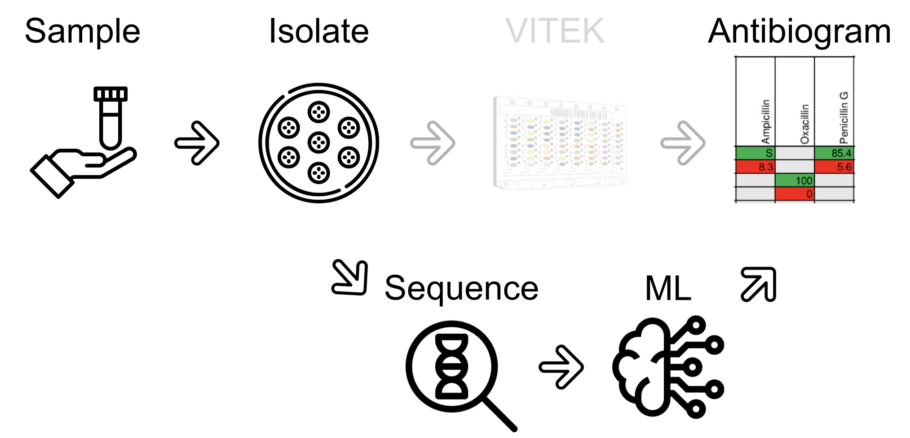
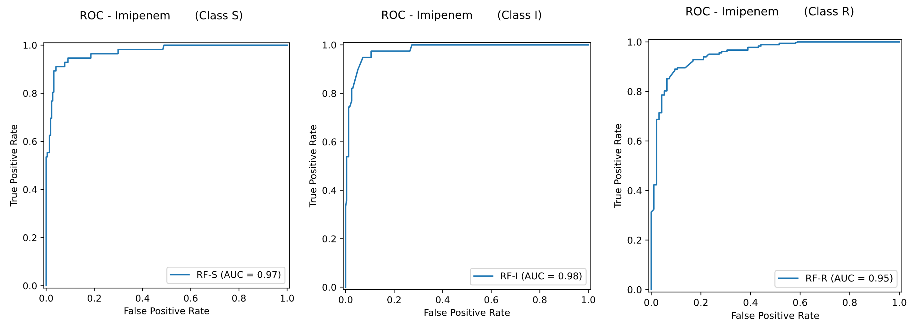

# WIN-KID 

This repository contains code and resources used accompanying the [WIN-KID](https://www.medizin.uni-muenster.de/win-kid/startseite.html) project.  
It includes data preprocessing pipeline, feature engineering, and machine learning models for **predicting antimicrobial resistance (AMR)** from AMR gene annotation gff3 files.

## 📖 About the Project

Antimicrobial resistance (AMR) is a major global health challenge.  
In this work, we analyze bacterial genomes from the **BV-BRC** database and locally sequenced isolates to develop machine learning models for predicting resistance phenotypes.  

We compared two approaches:
- **One-layer Random Forest (RF):** Independent models per antibiotic.  
- **Stacked Random Forest (RF):** Layered approach leveraging inter-antibiotic relationships.  

Evaluation was performed on *E. coli*, *K. pneumoniae*, and *A. baumannii* using Accuracy, F1-score, and ROC AUC.

## ⚙️ Installation and Quick Start

Follow the steps in [INSTALLATION.md](./INSTALLATION.md) to set everything up.  
The repository provides an `environment.yml` file for reproducibility.

## 🚀 Usage

Detailed usage instructions are provided in [USER_GUIDE.md](./USER_GUIDE.md).  
This includes preprocessing data, training models, and reproducing figures and evaluation metrics.

## 🎯 Goals of the Project

The **WIN-KID project** aims to develop and provide open tools for predicting antimicrobial resistance (AMR) directly from genomic data using machine learning.  

Our main goals are:
- **Accelerate AMR diagnostics** by reducing reliance on slow, culture-based testing.  
- **Improve prediction accuracy** by integrating AMR gene features with machine learning models.  
- **Develop a stacked Random Forest approach** that captures inter-antibiotic relationships.  
- **Enable reusability and scalability** so the models can be extended to new organisms or antibiotics.  
- **Provide reproducible workflows** through openly available code, datasets, and environment specifications.  

## 📊 Results

Our experiments demonstrate that the stacked Random Forest approach (**stackPred**) improves AMR prediction compared to a simple one-layer model.  
The method successfully captured inter-antibiotic relationships and achieved consistently strong performance across most antibiotics.  

Key takeaways:
- The stacked design enhances prediction reliability compared to baseline models.  
- Performance was robust across multiple bacterial species.  
- The pipeline is flexible and can easily incorporate additional antibiotics and organisms.  
- Future applications include metagenomic data, potentially eliminating the need for organism isolation in diagnostics.  

## 📂 Repository Structure

- `resources/` – figures and diagrams for the paper  
- `workflow/` – python source code for data processing and modeling
- `rf_models/` – previously trained and saved models
- `INSTALLATION.md` – installation guide  
- `USER_GUIDE.md` – user guide  

## 📧 Contact

For questions, please contact the WIN-KID team at [IKIM Essen](https://www.ikim.uk-essen.de/groups/ds).  

## Funding

