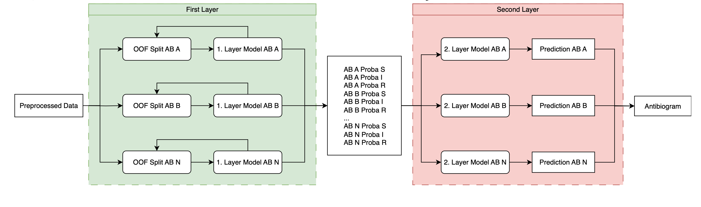

# User Guide

## Phenotype Prediction
### Preprocessing
- Genotypic and phenotypic data are read in directly, preprocessed and fed into an RF model
- Metrics such as ROC are calculated for the results

### Input Data
- Genotypic information needs to be provided as derived RGIs CARD results in .gff format
- Phenotypic information needs to be provided as antibiogram in .csv format

### Stacked Random Forest Example
Predict antibiogram for PATRIC samples on prepareddata and trained models:
- Set `MODE = Execution_Mode.PREDICT_ON_SAVED` in the `config.py`
- Run `python workflow/random_forest.py resources/settings/DataPaths_predict.csv`
- See result at `resources/DataSets/BVBRC_use_case/Result_BVBCR_use_case.csv`

### Stacked Random Forest Instructions
- Set `STACK_MODEL = True` in the `config.py`
- Train and Test:
  - Set `EXECUTION_MODE = Execution_Mode.TRAIN_TEST` in the `config.py`
  - Add the paths to the data records that shall be processed to `resources/settings/DataPaths.csv`
  - Run `python workflow/random_forest.py resources/settings/DataPaths.csv`
- Train models and save them for later predictions:
  - Set `EXECUTION_MODE = Execution_Mode.SAVE_TRAINED` in the `config.py`
  - Add the paths to the data records that shall be processed to `resources/settings/DataPaths.csv`
  - Run `python workflow/random_forest.py resources/settings/DataPaths.csv`
- Make predictions with earlier saved models:
  - Set `EXECUTION_MODE = Execution_Mode.PREDICT_ON_SAVED` in the `config.py`
  - Add the paths to the data records that shall be processed to `resources/settings/DataPaths.csv`. The csv corresponding to `PathToCsv` only needs to hold `Sample_ID_IfH` and `Organism_Code`
  - Run `python workflow/random_forest.py resources/settings/DataPaths.csv`

### Stacked Random Forest Architecture
Relies on two RF layers for prediction
- Test and training data sets are split once at the beginning
- Layer 1:
  - Input: pre-processed data
  - For each AB one RF model
  - The models are validated using out-of-fold iterations -> Test data is split into test and validation data
  - Output: Probabilities for each class (S/I/R)
- The Layer 1 results for each AB are combined
- Layer 2:
  - Input: combined input of Layer 1
  - For each AB one RF model
  - Output: The class with the highest probability according to the Layer 2

- Reasoning:
- Results of several ABs can be combined with each other despite the RF approach
- Correlations between the AB resistances can be learned
- Combination of multiple ABs is not possible with only one layer, because not all AB resistances are known for any sample and `NaN` is not supported as target value

### One Layer Random Forest
- Set `STACK_MODEL = False` and `EXECUTION_MODE` according to the desired outcome(see stacked RF) in the `config.py`
- Add the paths to the data records that are processed to the `resources/settings/DataPaths.csv`
- The starting point is the class `random_forest.py` which is used as follows:
`python workflow/random_forest.py resources/settings/DataPaths.csv`

## Further scripts

### Settings
- `names.csv` : List for uniform Oganism Name & Code and the Eucast json it should use
- `translations.csv` : Manual translation of typos / different vitek names for mic interpretation
- `ignore.csv` : Antibiotika Names that should be ignored in no match handling (interpreter)
### Parser UME
- Run via: `python workflow/vitek_parser_ume.py directory/vitek.csv directory/output/file.csv` with test data at `resources/test_data`
- works with tab seperated csv files only
- Removes unnecessary columns
- specify output **file** for the parsed VITEK file

### Parser UKM
- Run via: `python workflow/vitek_parser_ukm.py directory/vitek.csv directory/output/file.csv` with test data at `resources/test_data`
- Splits the VITEK file by bacteria name and replaces them with bacteria code (see names.csv)
- Removes unnecessary data and restructures the file
- specify output **folder** for the parsed VITEK files
- works with ";" seperated csv files only

### Parser BVBCR
- Run via: `python workflow/vitek_parser_bvbcr.py directory/vitek.csv directory/output/file.csv` with test data at `resources/test_data`
- Splits the VITEK file by bacteria name and replaces them with bacteria code (see names.csv)
- Removes unnecessary data and restructures the file
- specify output **folder** for the parsed VITEK files
- works with tab seperated csv files only

### Interpreter
- Run MIC interpreter to interpret any parsed files:
  `python workflow/mic_interpreter.py Prospective_Jan25/ToInterpret Prospective_Jan25/Interpreted`
- Can handle single and multiple Input files and can handle multiple organisms in one file
- Antibiotics from a VITEK file that can not be matched to an EUCAST antibiotic are skipped and logged via print
- Antibiotics with missing EUCAST Values (e.g.: '"S <=": "-",') are removed from the interpreted table
- For a match, the name of the VITEK antibiotic must be found in full in the EUCAST table
- If several values are found, the one with the highest similarity score is used. If two values have the same similarity, any one is used.
- If the selected value falls below a certain similarity score, it is also discarded and logged via print.
- If the EUCAST values for "S <=" and "R >" are different:
  - any VITEK value below or equal to the "S <=" EUCAST Value will be interpreted as "S"
  - any VITEK value between the "S <=" and "R >" EUCAST Value will be interpreted as "I"
  - any VITEK value above the "R >" EUCAST Value will be interpreted as "R"
- If the EUCAST values for "S <=" and "R >" are the same:
  - any VITEK value containing ">" will be interpreted as "R"
  - everything else will be interpteted as "S"

### GFF3 formatter
- Run via: `python gff3_formatter.py /groups/ds/Win-KID/UKM_Sciebo/Prospective_Jan25/card /groups/ds/Win-KID/UKM_Sciebo/Prospective_Jan25/gff_card`
- Transforms card annotation txt files in gff3 files

## ToDo
- Differentiate between oral and non oral?
- What shall happen with EUCAST values that are doublets (e.g.: due extra information)

## Evaluate Prediction
- Set `EVALUATE_PREDICTION` to true if predicted and real results shall be compared
- The real result csv file needs to contain resistance classification to perform that
- UME test data: `/groups/ds/Win-KID/UKM_Sciebo/Essen_Isolates/subset_0125_UME_Paper`
- UKM test data: `/groups/ds/Win-KID/UKM_Sciebo/Retrospective_Dec22-Jul24_all-species/subset_retro_UKM_Paper`